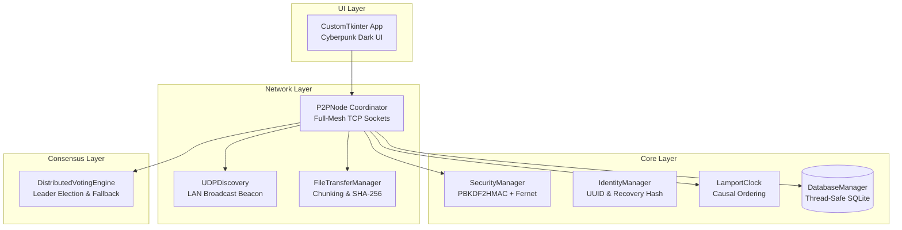
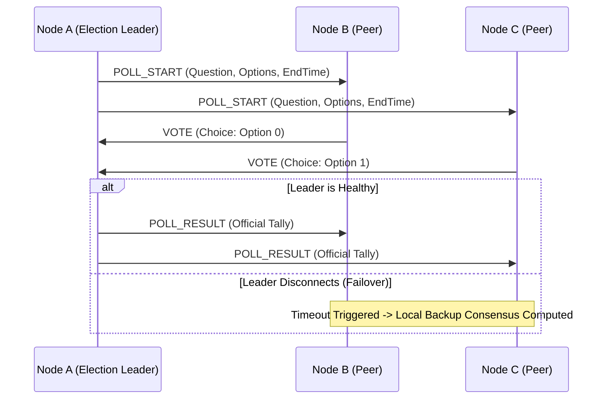

# 🚀 NEXUS P2P: Decentralized Communication, Causality & Consensus Engine

[](https://github.com/your-username/chat-p2p-system/actions)
[](https://www.python.org/)
[](https://opensource.org/licenses/MIT)
[]()

**NEXUS P2P** is an enterprise-grade, serverless peer-to-peer (P2P) communication platform built with Python. It implements **Lamport Logical Clocks** for causal event ordering, **End-to-End Encryption (E2EE)** via PBKDF2HMAC-derived symmetric ciphers, **P2P Chunked File Sharing with SHA-256 integrity**, and a **fault-tolerant distributed consensus engine** with automatic election leader failover.

---

## 🏛️ System Architecture



---

## 🌟 Key Distributed Systems Highlights

### 1. ⏱️ Distributed Causality with Lamport Logical Clocks
In decentralized systems, physical clock drift makes wall-clock ordering unreliable. NEXUS P2P enforces strict **causal partial ordering**:
* Each local event increments the internal clock: $L(e) = L_{local} + 1$.
* Outgoing packet envelopes embed the current $L(e)$.
* Receiving peers synchronize clocks via: $L_{local} = \max(L_{local}, L_{received}) + 1$.
* Chat and state logs are indexed and retrieved strictly by logical clock sequence.

### 2. 🔐 Applied Cryptography & Channel Isolation
* **PBKDF2HMAC Key Derivation:** SHA-256 with 100,000 iterations and static domain salts.
* **Fernet Symmetric Cipher:** Authenticated encryption for zero-knowledge data transit.
* **Room Fingerprinting:** Derives unique 4-character channel fingerprints to instantly drop unauthorized foreign packets.

### 3. 📎 P2P Encrypted File Sharing Engine
* Streams arbitrary binary files (images, PDFs, documents) in 32 KB chunked base64 envelopes.
* Performs full **SHA-256 cryptographic verification** upon reception before writing to `downloads/`.
* Background non-blocking streaming threads ensure uninterrupted UI responsiveness.

### 4. 🗳️ Fault-Tolerant Distributed Consensus & Voting


---

## 📂 Modular Package Structure

```
chat-p2p-system/
├── .github/workflows/
│   └── ci.yml               # GitHub Actions CI Matrix (Win/Ubuntu/Mac)
├── nexus/
│   ├── core/
│   │   ├── security.py      # PBKDF2HMAC, Fernet & Room Fingerprinting
│   │   ├── identity.py      # UUID generation & 4-char Recovery Hashes
│   │   ├── clock.py         # Lamport Logical Clock implementation
│   │   ├── database.py      # Thread-safe SQLite store & causal sorting
│   │   └── protocol.py      # Standardized packet envelope schemas
│   ├── network/
│   │   ├── discovery.py     # UDP broadcast beaconing & listener
│   │   ├── file_transfer.py # Chunked file sender/receiver & SHA-256 check
│   │   └── node.py          # TCP mesh coordinator & packet dispatcher
│   ├── consensus/
│   │   └── election.py      # Distributed ballot engine & fallback tallies
│   └── ui/
│       ├── theme.py         # Cyberpunk Dark color tokens
│       ├── components.py    # Sub-windows (Private Rooms, Message Manager)
│       └── app.py           # CustomTkinter reactive application
├── tests/
│   ├── test_security.py
│   ├── test_clock.py
│   ├── test_database.py
│   ├── test_file_transfer.py
│   └── test_p2p.py
├── main.py                  # Standard application entry point
├── p2p_chat_distributed.py  # Backwards-compatible launcher
├── requirements.txt
└── pyproject.toml
```

---

## 🚀 Quick Start

### 1. Installation
```bash
# Clone the repository
git clone https://github.com/your-username/chat-p2p-system.git
cd chat-p2p-system

# Install dependencies
pip install -r requirements.txt
```

### 2. Launch Multi-Node Mesh
Open two terminal windows:

* **Node 1 (Alice):**
  ```bash
  python main.py
  ```
  * Username: `Alice` | Network Key: `123` $\rightarrow$ Connect.

* **Node 2 (Bob):**
  ```bash
  python main.py
  ```
  * Username: `Bob` | Network Key: `123` $\rightarrow$ Connect.

Nodes automatically discover each other via UDP broadcast beacons and establish direct TCP mesh streams.

---

## 🧪 Running the Test Suite

Execute the full suite of unit, concurrency, and integration tests:

```bash
python -m unittest discover -v -s tests
```

---

## 💼 Resume & Interview Bullet Points

```markdown
### NEXUS P2P: Distributed Secure Messaging & Consensus System | Python, Sockets, Cryptography, SQLite
- Designed a decentralized serverless communication engine using raw TCP sockets, multi-threading, and UDP auto-discovery beacons.
- Implemented Lamport Logical Clocks to enforce strict causal message ordering across asynchronous peer nodes.
- Built End-to-End Encryption (E2EE) with PBKDF2HMAC key derivation (SHA-256, 100k iterations) and Fernet authenticated ciphers.
- Developed an encrypted chunked P2P file transfer engine with SHA-256 checksum verification and non-blocking background streaming.
- Engineered a fault-tolerant distributed consensus protocol featuring election leader coordination and automated local fallback tallies.
- Maintained a modular architecture with 100% test pass rate across a multi-OS CI/CD pipeline (Windows, macOS, Ubuntu).
```